<div align="center">
  
</div>

<br/>

### ⚡ Identity Telemetry

```bash
> quantum.scan(LINGESH_R)
├── Role         : Java Full Stack Developer | Full Stack Developer | Coder
├── Affiliation  : Developer at Hackerz
├── Education    : B.E. Computer Science & Engineering, Chennai Institute of Technology
├── Location     : Panruti, Tamil Nadu, India
├── Benchmark    : 600+ LeetCode Problems Solved (1500+ Rating)
└── Focus        : Scalable Web Systems, Backend Pipelines & Algorithmic Problem Solving
